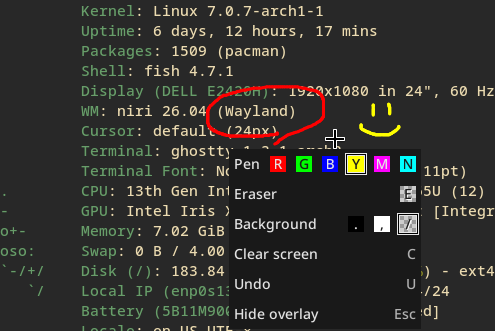

# Waydoodle

A minimalistic Wayland screen annotation tool. Draw on your screen during
presentations, demos, or video calls — on any Wayland compositor.



Waydoodle is similar to other tools like
[Gromit-MPX](https://github.com/bk138/gromit-mpx) or
[Wayscriber](https://wayscriber.com/), but with a focus on simplicity and ease
of use. Some of its features include:

- Tray icon with menu
- Global shortcut (see [below](#global-shortcut))
- Mouse & tablet support
- Tablet pad buttons
- Context menu
- Undo

## Installation

### From source

Make sure you have a [Rust toolchain](https://rustup.rs/) installed, then:

```
git clone https://github.com/dessaya/waydoodle.git
cd waydoodle
cargo install --path .
```

Building requires the udev development files: they are part of `systemd` on
Arch, `libudev-dev` on Debian and Ubuntu, and `systemd-devel` on Fedora.

### Arch Linux (AUR)

Install the [`waydoodle`](https://aur.archlinux.org/packages/waydoodle)
package with your preferred AUR helper:

```
paru -S waydoodle
```

## Usage

Launch Waydoodle from your application menu or from a terminal:

```
waydoodle
```

A tray icon will appear. Use its menu, or send `SIGUSR1` to toggle the
annotation overlay on and off:

```
pkill -SIGUSR1 waydoodle
```

If the XDG Layer Shell protocol is supported by your compositor, the overlay
will be displayed on top of all windows and will not receive input events when
inactive.

Hit <kbd>Esc</kbd> or send `SIGUSR2` to close the overlay (destroying the
current drawing):

```
pkill -SIGUSR2 waydoodle
```

While the overlay is focused, just draw with your mouse or tablet.

| Key | Action |
|-----|--------|
| <kbd>Space</kbd>, <kbd>Right Click</kbd> | Toggle context menu |
| <kbd>r</kbd> | Red pen |
| <kbd>g</kbd> | Green pen |
| <kbd>b</kbd> | Blue pen |
| <kbd>y</kbd> | Yellow pen |
| <kbd>m</kbd> | Magenta pen |
| <kbd>n</kbd> | Cyan pen |
| <kbd>e</kbd> | Eraser (also with middle mouse button) |
| <kbd>c</kbd> | Clear all |
| <kbd>.</kbd> | Black background |
| <kbd>,</kbd> | White background |
| <kbd>/</kbd> | Transparent background |
| <kbd>u</kbd> | Undo |
| <kbd>Esc</kbd> | Close overlay |

## Tablet pad buttons

If your drawing tablet has buttons on its side, Waydoodle can listen to them
directly:

```
waydoodle --tablet-pad
```

| Button | Action |
|--------|--------|
| 0 | Toggle overlay |
| 1 | Close overlay |
| 2 | Eraser |
| 3 | Red pen |
| 4 | Green pen |
| 5 | Magenta pen |

The buttons are numbered the way `libinput debug-events` reports them. The
bindings are not configurable yet, and neither is the `--tablet-pad` flag
permanent: both will be replaced by a configuration file.

Waydoodle reads the pad device directly instead of going through the
compositor, because the Wayland tablet protocol is not implemented by every
compositor (niri, for instance, never sends pad events to clients), and where
it is, the buttons only work while the overlay is focused — which is of no use
for the button that is supposed to bring it up.

This means your user needs permission to read the tablet pad device, which on
most distributions means being a member of the `input` group:

```
sudo usermod -aG input $USER
```

Log out and back in for it to take effect.

If the buttons do nothing, run Waydoodle with `RUST_LOG=waydoodle=debug` to see
which pads it found and which buttons they report.

## Global shortcuts

The XDG Global Shortcuts protocol is not yet widely supported by Wayland
compositors, so Waydoodle falls back to listening for the `SIGUSR1` and
`SIGUSR2` signals to toggle the overlay and close it, respectively.

Register a global shortcut in your desktop environment or window
manager of choice that executes:

```
pkill -SIGUSR1 waydoodle
```

```
pkill -SIGUSR2 waydoodle
```

## License

MIT. See [LICENSE](LICENSE) for details.
